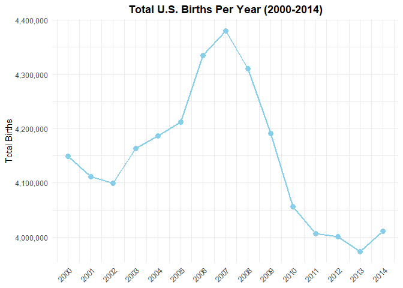
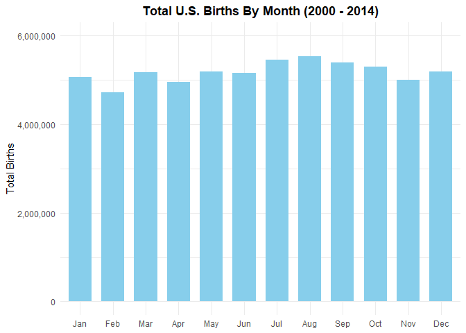
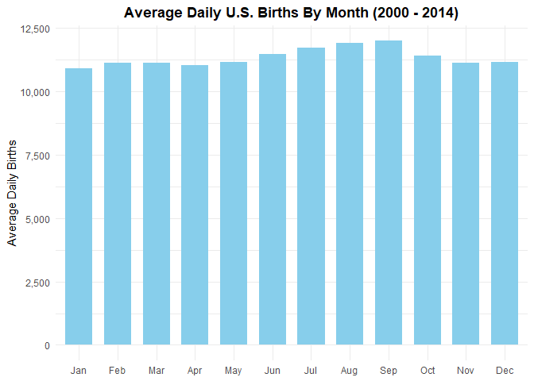

# Data Visualization Project 1

## Introduction

This report analyzes data surrounding births in the United States from the years 2000 to 2014. Through the utilization of RStudio and its `tidyverse` package, three unique data visualizations were produced utilizing this U.S. birth data. These visualizations help to provide insight into various birth trends within the United States during this 15 year window which can play an important role in future domestic policy decisions.


``` r
library(tidyverse)
library(scales)
library(plotly)
```


``` r
us_births_00_14 <- read_csv("../data/us_births_00_14.csv")
glimpse(us_births_00_14)
```

```
## Rows: 5,479
## Columns: 6
## $ year          <dbl> 2000, 2000, 2000, 2000, 2000, 2000, 2000, 2000, 2000, 20…
## $ month         <dbl> 1, 1, 1, 1, 1, 1, 1, 1, 1, 1, 1, 1, 1, 1, 1, 1, 1, 1, 1,…
## $ date_of_month <dbl> 1, 2, 3, 4, 5, 6, 7, 8, 9, 10, 11, 12, 13, 14, 15, 16, 1…
## $ date          <date> 2000-01-01, 2000-01-02, 2000-01-03, 2000-01-04, 2000-01…
## $ day_of_week   <chr> "Sat", "Sun", "Mon", "Tues", "Wed", "Thurs", "Fri", "Sat…
## $ births        <dbl> 9083, 8006, 11363, 13032, 12558, 12466, 12516, 8934, 794…
```
> _The data shown above acts as a way to glimpse the variables within this US births from 2000 to 2014 data set. This helps with determining what data visualizations can be created from these variables and this set of data._

## Chart Selection

Now, after glimpsing this US birth data, there were two specific data visualizations which immediately came to mind. The first of these two data visualizations would be looking at total US births per year while the second would look at US birth distribution by month. For the first data visualization, a line chart was selected because line charts excel at displaying time related trends while keeping their simplicity. In the case of the second data visualization, a bar chart was selected because bar charts are good for comparing discrete groups of data against one another, which would be good for comparing month to month birth distribution. Finally, after deciding on the third and final data visualization idea, which was to look at average daily US births by day of the week, a bar chart was once again selected. This was for the same aforementioned reason that bar charts excel at comparing discrete groups of data to one another. Therefore, it would be perfect for comparing the average US births for each day of the week.

## Annual US Birth Trends (2000 - 2014)

In this first section, the long-term trajectory of births in the U.S. is examined. All of the birth data for each year was displayed as total number of births which allowed for the observation of the national birth rate trends. 


``` r
us_births_annually <- us_births_00_14 %>%
  group_by(year) %>%
  summarize(total_births = sum(births))
```


``` r
ggplot(data = us_births_annually, aes(x = year, y = total_births)) +
  geom_line(color = "skyblue", size = 1) +
  geom_point(color = "skyblue", size = 3) +
  scale_x_continuous(breaks = 2000:2014) +
  scale_y_continuous(labels = comma) + 
  labs(title = "Total U.S. Births Per Year (2000-2014)",
       x = "Year",
       y = "Total Births") +
  theme_minimal() +
  theme(plot.title = element_text(hjust = 0.5, face = "bold"),
        axis.text.x = element_text(angle = 45, hjust = 1),
        axis.title.x = element_blank())
```



> _This first figure showcases the total number of births within the United States for each individual year during a 15 year span ranging from 2000 to 2014. In the early to mid - 2000's, an increase in births can be seen which peaks in 2007 with over 4.3 million births. Then, beginning in 2008 alongside the Great Recession, a sharp decrease can be seen which lasts until 2014. This demonstrates how economic conditions could be considered as one of many influential factors which can influence whether families within a country plan on and end up having children._

## Bad Chart Redesign: Monthly US Birth Distribution (2000 - 2014)

### Original Version (Before Redesign)


``` r
us_births_monthly <- us_births_00_14 %>%
  group_by(month) %>%
  summarize(total_births = sum(births)) %>%
  mutate(month_name = factor(month.abb[month], levels = month.abb))
```


``` r
ggplot(data = us_births_monthly, aes(x = month_name, y = total_births)) + 
  geom_col(fill = "skyblue", width = 0.7) +
  scale_y_continuous(limits = c(0, 6000000), labels = comma) + 
  labs(title = "Total U.S. Births By Month (2000 - 2014)",
       x = "Month",
       y = "Total Births") +
  theme_minimal() +
  theme(plot.title = element_text(hjust = 0.5, face = "bold"),
        axis.title.x = element_blank())
```



**Discussion:** While this original column chart successfully identifies a general trend which showcases that higher total birth volumes occur in the late summer and early autumn, it has a big flaw. This flaw is calendar day bias. Aggregating raw birth counts strictly by calendar month introduces distortion because each month does not contain an equal number of days. A perfect example of this can be seen by comparing a 28-day February directly against a 31-day March. February is penalized by missing three full days of data collection. Conversely, longer months with 31 days (March, May, July, etc.) receive an artificial boost in births, rather than seeing an actual increase in birth rates.

### Improved Version (After Redesign)


``` r
us_births_monthly_avg <- us_births_00_14 %>%
  group_by(year, month) %>%
  summarize(total_births = sum(births),
            days_in_month = n(), .groups = "drop") %>%
  group_by(month) %>%
  summarize(avg_daily_births = sum(total_births) / sum(days_in_month))
```


``` r
ggplot(us_births_monthly_avg, aes(x = factor(month, labels = c("Jan", "Feb", "Mar", "Apr", "May", "Jun", "Jul", "Aug",
                                                               "Sep", "Oct", "Nov", "Dec")), y = avg_daily_births)) +
  geom_col(fill = "skyblue", width = 0.7) +
  scale_y_continuous(labels = comma) +
  labs(title = "Average Daily U.S. Births By Month (2000 - 2014)",
       x = "Month",
       y = "Average Daily Births") +
  theme_minimal() +
  theme(plot.title = element_text(hjust = 0.5, face = "bold"),
        axis.title.x = element_blank())
```



**Discussion:** Though this normalized column chart looks somewhat similar to the original, it resolves the calendar limitations of the original aggregated plot by transitioning from displaying raw monthly sums to showing a true daily average distribution rate. This was done by calculating the mean number of births per day within each specific month, ensuring that every month is properly evaluated. February is no longer penalized for its shorter 28-day length, and 31-day months are stripped of their artificial advantage. Now, this visualization confirms that even when accounting for day counts, an increase in average daily births still takes place during the late summer, clearly peaking in August and September.

## Average US Births by Day of the Week (Interactive Plot)

Finally, in this third section, the average daily births across the days of the week (Monday, Tuesday, Wednesday, Thursday, Friday, Saturday, & Sunday) were observed. This was done by tracking the average number of births for day of the week for each year to look for outliers or trends.


``` r
us_births_day_of_week <- us_births_00_14 %>%
  group_by(year, day_of_week) %>%
  summarize(yearly_daily_avg = mean(births, na.rm = TRUE), .groups = "drop") %>%
  group_by(day_of_week) %>%
summarize(
    global_average = mean(yearly_daily_avg),
    hover_text = paste0(
      "<b>", unique(day_of_week), " Global Average: </b>", comma(round(global_average)), "<br>",
      "<b>Yearly Variations:</b><br>",
      paste0(
        "2000: ", comma(round(yearly_daily_avg[year==2000])), 
        " &nbsp;|&nbsp; 2005: ", comma(round(yearly_daily_avg[year==2005])), 
        " &nbsp;|&nbsp; 2010: ", comma(round(yearly_daily_avg[year==2010])), 
        "<br>",
        "2001: ", comma(round(yearly_daily_avg[year==2001])), 
        " &nbsp;|&nbsp; 2006: ", comma(round(yearly_daily_avg[year==2006])), 
        " &nbsp;|&nbsp; 2011: ", comma(round(yearly_daily_avg[year==2011])), 
        "<br>",
        "2002: ", comma(round(yearly_daily_avg[year==2002])),
        " &nbsp;|&nbsp; 2007: ", comma(round(yearly_daily_avg[year==2007])), 
        " &nbsp;|&nbsp; 2012: ", comma(round(yearly_daily_avg[year==2012])), 
        "<br>",
        "2003: ", comma(round(yearly_daily_avg[year==2003])), 
        " &nbsp;|&nbsp; 2008: ", comma(round(yearly_daily_avg[year==2008])),
        " &nbsp;|&nbsp; 2013: ", comma(round(yearly_daily_avg[year==2013])), 
        "<br>",
        "2004: ", comma(round(yearly_daily_avg[year==2004])),
        " &nbsp;|&nbsp; 2009: ", comma(round(yearly_daily_avg[year==2009])), 
        " &nbsp;|&nbsp; 2014: ", comma(round(yearly_daily_avg[year==2014])))), 
    .groups = "drop") %>%
  mutate(day_of_week = factor(day_of_week, 
                              levels = c("Mon", "Tues", "Wed", "Thurs", "Fri", "Sat", "Sun"),
                              labels = c("Monday", "Tuesday", "Wednesday", "Thursday", "Friday", "Saturday", "Sunday"))) %>%
  arrange(day_of_week)
```


``` r
plot <- ggplot(data = us_births_day_of_week, aes(x = day_of_week, y = global_average, text = hover_text)) + 
  geom_col(fill = "skyblue", width = 0.6) +
  theme_classic(base_size = 12) +
  scale_y_continuous(labels = scales::comma_format()) +
  labs(title = "Average U.S. Births by Day of the Week (2000 - 2014)", 
       x = "Day of the Week", 
       y = "Average Daily Births") + 
  theme(plot.title = element_text(hjust = 0.5, face = "bold", size = 15),
        axis.title.x = element_blank())

ggplotly(plot, tooltip = "text")
```

```{=html}
<div class="plotly html-widget html-fill-item" id="htmlwidget-c36b57a2c8d38497d8f5" style="width:672px;height:480px;"></div>
<script type="application/json" data-for="htmlwidget-c36b57a2c8d38497d8f5">{"x":{"data":[{"orientation":"v","width":[0.60000000000000009,0.59999999999999987,0.59999999999999964,0.59999999999999964,0.59999999999999964,0.59999999999999964,0.59999999999999964],"base":[0,0,0,0,0,0,0],"x":[1,2,3,4,5,6,7],"y":[11898.151862602806,13122.958538945331,12911.092960812772,12845.657643928398,12596.814852443154,8562.5422593130133,7517.9456458635705],"text":["<b>Mon Global Average: <\/b>11,898<br><b>Yearly Variations:<\/b><br>2000: 11,514 &nbsp;|&nbsp; 2005: 11,911 &nbsp;|&nbsp; 2010: 11,821<br>2001: 11,434 &nbsp;|&nbsp; 2006: 12,277 &nbsp;|&nbsp; 2011: 11,557<br>2002: 11,672 &nbsp;|&nbsp; 2007: 12,444 &nbsp;|&nbsp; 2012: 11,565<br>2003: 11,940 &nbsp;|&nbsp; 2008: 12,547 &nbsp;|&nbsp; 2013: 11,732<br>2004: 11,928 &nbsp;|&nbsp; 2009: 12,258 &nbsp;|&nbsp; 2014: 11,873","<b>Tues Global Average: <\/b>13,123<br><b>Yearly Variations:<\/b><br>2000: 12,871 &nbsp;|&nbsp; 2005: 13,439 &nbsp;|&nbsp; 2010: 13,034<br>2001: 12,791 &nbsp;|&nbsp; 2006: 13,644 &nbsp;|&nbsp; 2011: 12,857<br>2002: 12,854 &nbsp;|&nbsp; 2007: 13,815 &nbsp;|&nbsp; 2012: 12,565<br>2003: 13,269 &nbsp;|&nbsp; 2008: 13,643 &nbsp;|&nbsp; 2013: 12,469<br>2004: 13,309 &nbsp;|&nbsp; 2009: 13,559 &nbsp;|&nbsp; 2014: 12,725","<b>Wed Global Average: <\/b>12,911<br><b>Yearly Variations:<\/b><br>2000: 12,762 &nbsp;|&nbsp; 2005: 13,296 &nbsp;|&nbsp; 2010: 12,840<br>2001: 12,657 &nbsp;|&nbsp; 2006: 13,733 &nbsp;|&nbsp; 2011: 12,594<br>2002: 12,582 &nbsp;|&nbsp; 2007: 13,758 &nbsp;|&nbsp; 2012: 12,406<br>2003: 12,842 &nbsp;|&nbsp; 2008: 13,397 &nbsp;|&nbsp; 2013: 12,190<br>2004: 13,117 &nbsp;|&nbsp; 2009: 13,254 &nbsp;|&nbsp; 2014: 12,238","<b>Thurs Global Average: <\/b>12,846<br><b>Yearly Variations:<\/b><br>2000: 12,735 &nbsp;|&nbsp; 2005: 13,251 &nbsp;|&nbsp; 2010: 12,670<br>2001: 12,727 &nbsp;|&nbsp; 2006: 13,673 &nbsp;|&nbsp; 2011: 12,489<br>2002: 12,614 &nbsp;|&nbsp; 2007: 13,783 &nbsp;|&nbsp; 2012: 12,459<br>2003: 12,743 &nbsp;|&nbsp; 2008: 13,343 &nbsp;|&nbsp; 2013: 12,194<br>2004: 12,877 &nbsp;|&nbsp; 2009: 12,946 &nbsp;|&nbsp; 2014: 12,181","<b>Fri Global Average: <\/b>12,597<br><b>Yearly Variations:<\/b><br>2000: 12,524 &nbsp;|&nbsp; 2005: 12,883 &nbsp;|&nbsp; 2010: 12,126<br>2001: 12,557 &nbsp;|&nbsp; 2006: 13,357 &nbsp;|&nbsp; 2011: 12,205<br>2002: 12,510 &nbsp;|&nbsp; 2007: 13,520 &nbsp;|&nbsp; 2012: 12,192<br>2003: 12,616 &nbsp;|&nbsp; 2008: 13,114 &nbsp;|&nbsp; 2013: 12,133<br>2004: 12,557 &nbsp;|&nbsp; 2009: 12,545 &nbsp;|&nbsp; 2014: 12,113","<b>Sat Global Average: <\/b>8,563<br><b>Yearly Variations:<\/b><br>2000: 9,050 &nbsp;|&nbsp; 2005: 8,577 &nbsp;|&nbsp; 2010: 8,092<br>2001: 8,895 &nbsp;|&nbsp; 2006: 8,856 &nbsp;|&nbsp; 2011: 8,085<br>2002: 8,708 &nbsp;|&nbsp; 2007: 8,926 &nbsp;|&nbsp; 2012: 8,196<br>2003: 8,730 &nbsp;|&nbsp; 2008: 8,717 &nbsp;|&nbsp; 2013: 8,211<br>2004: 8,628 &nbsp;|&nbsp; 2009: 8,405 &nbsp;|&nbsp; 2014: 8,363","<b>Sun Global Average: <\/b>7,518<br><b>Yearly Variations:<\/b><br>2000: 8,014 &nbsp;|&nbsp; 2005: 7,476 &nbsp;|&nbsp; 2010: 7,184<br>2001: 7,777 &nbsp;|&nbsp; 2006: 7,681 &nbsp;|&nbsp; 2011: 7,114<br>2002: 7,646 &nbsp;|&nbsp; 2007: 7,761 &nbsp;|&nbsp; 2012: 7,196<br>2003: 7,672 &nbsp;|&nbsp; 2008: 7,617 &nbsp;|&nbsp; 2013: 7,242<br>2004: 7,611 &nbsp;|&nbsp; 2009: 7,380 &nbsp;|&nbsp; 2014: 7,397"],"type":"bar","textposition":"none","marker":{"autocolorscale":false,"color":"rgba(135,206,235,1)","line":{"width":1.8897637795275593,"color":"transparent"}},"showlegend":false,"xaxis":"x","yaxis":"y","hoverinfo":"text","frame":null}],"layout":{"margin":{"t":43.895392278953921,"r":7.9701120797011216,"b":24.707347447073481,"l":66.151930261519325},"plot_bgcolor":"rgba(255,255,255,1)","paper_bgcolor":"rgba(255,255,255,1)","font":{"color":"rgba(0,0,0,1)","family":"","size":15.940224159402243},"title":{"text":"<b> Average U.S. Births by Day of the Week (2000 - 2014) <\/b>","font":{"color":"rgba(0,0,0,1)","family":"","size":19.9252801992528},"x":0.5,"xref":"paper"},"xaxis":{"domain":[0,1],"automargin":true,"type":"linear","autorange":false,"range":[0.40000000000000002,7.5999999999999996],"tickmode":"array","ticktext":["Monday","Tuesday","Wednesday","Thursday","Friday","Saturday","Sunday"],"tickvals":[1,2,3,4.0000000000000009,5,6,7],"categoryorder":"array","categoryarray":["Monday","Tuesday","Wednesday","Thursday","Friday","Saturday","Sunday"],"nticks":null,"ticks":"outside","tickcolor":"rgba(0,0,0,1)","ticklen":3.9850560398505608,"tickwidth":0.72455564360919278,"showticklabels":true,"tickfont":{"color":"rgba(0,0,0,1)","family":"","size":12.7521793275218},"tickangle":-0,"showline":true,"linecolor":"rgba(0,0,0,1)","linewidth":0.72455564360919278,"showgrid":false,"gridcolor":null,"gridwidth":0,"zeroline":false,"anchor":"y","title":{"text":"","font":{"color":null,"family":null,"size":0}},"hoverformat":".2f"},"yaxis":{"domain":[0,1],"automargin":true,"type":"linear","autorange":false,"range":[-656.14792694726657,13779.106465892597],"tickmode":"array","ticktext":["0","5,000","10,000"],"tickvals":[0,5000,10000],"categoryorder":"array","categoryarray":["0","5,000","10,000"],"nticks":null,"ticks":"outside","tickcolor":"rgba(0,0,0,1)","ticklen":3.9850560398505608,"tickwidth":0.72455564360919278,"showticklabels":true,"tickfont":{"color":"rgba(0,0,0,1)","family":"","size":12.7521793275218},"tickangle":-0,"showline":true,"linecolor":"rgba(0,0,0,1)","linewidth":0.72455564360919278,"showgrid":false,"gridcolor":null,"gridwidth":0,"zeroline":false,"anchor":"x","title":{"text":"Average Daily Births","font":{"color":"rgba(0,0,0,1)","family":"","size":15.940224159402243}},"hoverformat":".2f"},"shapes":[],"showlegend":false,"legend":{"bgcolor":"rgba(255,255,255,1)","bordercolor":"transparent","borderwidth":2.0615604867573372,"font":{"color":"rgba(0,0,0,1)","family":"","size":12.7521793275218}},"hovermode":"closest","barmode":"relative"},"config":{"doubleClick":"reset","modeBarButtonsToAdd":["hoverclosest","hovercompare"],"showSendToCloud":false},"source":"A","attrs":{"3e204fff5fe0":{"x":{},"y":{},"text":{},"type":"bar"}},"cur_data":"3e204fff5fe0","visdat":{"3e204fff5fe0":["function (y) ","x"]},"highlight":{"on":"plotly_click","persistent":false,"dynamic":false,"selectize":false,"opacityDim":0.20000000000000001,"selected":{"opacity":1},"debounce":0},"shinyEvents":["plotly_hover","plotly_click","plotly_selected","plotly_relayout","plotly_brushed","plotly_brushing","plotly_clickannotation","plotly_doubleclick","plotly_deselect","plotly_afterplot","plotly_sunburstclick"],"base_url":"https://plot.ly"},"evals":[],"jsHooks":[]}</script>
```

>*This third figure displays a clear distinction between the number of average daily births on weekdays versus weekends, with the maximum peaking at over 13,000 on Tuesdays and the minimum dropping to roughly 7,500 on Sundays. While the average birth rates remain fairly consistent throughout the work week (Monday through Friday), a sharp drop is encountered right when the weekend begins. Now, this weekend decline can possibly be explained due to many deliveries, especially ones that require medical assistance, being scheduled during the work week. This could account for the notable decrease in average daily births that take place during the weekend as less operations tend to be scheduled during both Saturday and Sunday. This plot is interactive. By dragging the cursor over each bar, the user can view the exact overall number of average births for that day of the week alongside the individual number of average births for that day of the week for each year.*

**Interactive vs. Static Visualizations:** A static version of this chart successfully displays the differences between weekday and weekend births, but it doesn't show any other individual information throughout the individual years of this dataset. However, by making this chart interactive, this issue is resolved by allowing the user to hover over each bar for each day of the week to view extra information. The viewer can easily view the overall number of average births per day of the week, as well as see the individual averages for each of the fifteen years. Therefore, this interactive data visualization has the ability to display more data without cluttering the primary information that the chart is displaying, accomplishing something that would be much more difficult to pull off with a static data visualization.

## General Discussion

In summary, the three data visualizations created from the U.S. birth data over the 15-year period of 2000 to 2014 help to clearly display a few meaningful birth trends within the United States. The first figure demonstrates that factors such as the economy could be influential when it comes to national birth rates. When the economy is stable or growing, birth rates tend to increase as seen in the early to mid-2000s, however, as seen from after the birth peak in 2007, a notable decrease in total births can be seen indicating that economic downturn like that experience during the Great Recession could play a role when it comes to national births. As for the second figure, it showcases that even when accounting for calendar day bias, an increase in average daily births occurs during the late summer, peaking cleanly in August and September. In the case of the winter months like January and February, the opposite can be seen with a decrease in average daily births taking place. Finally, the third figure reveals an easily observable trend in daily birth distribution across the days of the week. While average daily birth rates remain consistently elevated above 13,000 during standard workdays, they experience a dramatic drop down to roughly 7,500 births on Saturdays and Sundays. This can possibly be explained by common medical scheduling practices where delivery procedures are more commonly scheduled during the week rather than on weekends, hence the notable increase in daily birth distribution during the work week and a decrease during the weekend. Now, all of these data visualizations were made while keeping a few data visualization principles in mind, with the first and foremost principle being to avoid unnecessary chart junk. Chart junk can turn what could be a simple and easily readable figure into an ugly mess that is more difficult for an audience to interpret, leading to confusion and working against the data being presented. By utilizing clean axes, clear labels, and minimalist themes, these figures allow the reader to focus entirely on the actual trends rather than visual distractions. Another data visualization principle utilized in the creation of these figures was color. The skyblue bars and points help draw immediate attention to the data points themselves without overwhelming the reader or being too bland, which could cause the audience's attention to be lost. Additionally, multiple Gestalt principles were intentionally applied across these visualizations. The principle of continuity was utilized in the line charts to connect individual years together sequentially, which visually emphasizes that continuous nature of the time related data. The Gestalt principle of proximity was also used in the bar charts to structurally separate individual monthly and weekly categories, ensuring that each column stands individually. In the third figure showcasing average US births by day of the week, proximity works to naturally group weekdays together at a high visual ceiling, while setting the weekend days distinctly lower. Lastly, the principle of interactivity was introduced to add increased utility to the third figure. It now allows the user to hover over individual columns to view more data that isn't shown on the static version of the chart. Therefore, this interactive data visualization now has the ability to display more data without cluttering the primary information that the chart is displaying, accomplishing something that would be much more difficult to pull off with a static data visualization. Without utilizing these core data visualization principles, these figures would likely be far less effective in displaying the underlying data relationships as well as conveying the real-world insights that were found.
