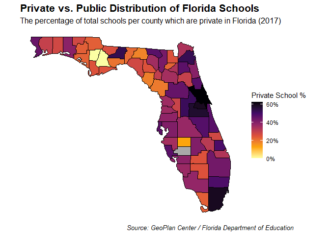
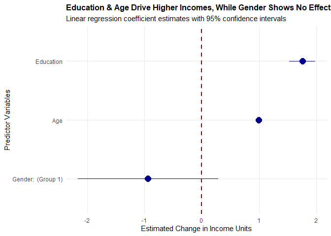

# Data Visualization Project 2

## Introduction

The primary objective of this mini-project and this report was to utilize knowledge learned within this course of Data Visualization and Reproducible Research to create more engaging and useful data visualizations. These data visualizations created for this mini-project consist of one interactive plot, one spatial visualization, and one visualization of a model in the form of a coefficient plot. They were created by utilizing three unique and independent datasets which were respectively looking at NBA championships, public vs. private school distribution across Florida counties in 2017, and personal income. This report breaks down the creation of these three data visualizations while elaborating on the content and takeaways that they convey. Furthermore, this report includes a before-and-after redesign of the spatial visualization section to demonstrate that while the original choropleth wasn't terrible, simple additions can drastically improve the takeaways which a visualization can convey.


``` r
library(tidyverse)
library(plotly)
library(sf)
library(scales)
library(maps)
library(broom)
```
>*Above are the various libraries that were required for this mini-project. They all contain functions that were relevant to the creation of all these data visualizations and therefore are a necessity.*

## Project Planning

For this mini-project, since the types of data visualizations required had been specified from the start, determining chart types was a relatively simple process. With the interactive plot, the goal was to build a data visualization like a bar chart or scatter plot that would allow a user to view extra information by interacting with the data or data points featured. To do this, the `NBAchampionsdata` dataset was selected with the intent of creating a scatter plot which showed all the games for a specific year's championship series and information about each of those games. Now, when the user interacts with the data points on the plot, they will see game information such as game number, the points scored that game, the venue (Home/Away), and the result (Win/Loss), the number of turnovers, etc. This gives the user an easy way to access relevant information on the championship team's performance during any individual game in that series. The user is also able to interact with the legend and hide certain data points based on what they want to see. So, if they are strictly trying to look at away games, losses, etc. they can remove other data points to make this easier. These interactions allow the user to easily get an in depth idea of how the championship team that year performed during their finals series as well as see how volatile their performances can be during these series. Unlike the interactive plot, the plan for the spatial visualization from the beginning was to create a choropleth map. As for the specifics of the choropleth map, that would depend on the dataset selected. So, after looking through the datasets provided, the `Public_Private_Schools_in_Florida-2017` was chosen with the goal of creating a choropleth of Florida and its counties. Now, based on the dataset selected, this choropleth would be displaying the density of private schools within each Florida county as a percentage of their total schools respectively. The goal of this choropleth would be to show the distribution of private schools across the state of Florida in its entirety to see if there are any correlations to be made. As for the visualization of a model, a coefficients plot was selected as it is relatively easy to interpret and effective at conveying statistical significance. Therefore after browsing the provided datasets and selecting the `income` dataset, the goal for the standardized coefficients plot became clear. It would display which of three variables, `Education`, `Age`, and `Gender` were considered as statistically significant when determining income as well as the certainty of these findings. This would allow someone to understand which of those variables have a more meaningful impact than others on income. 

## Data Preparation

In regard to the data preparation taken for the interactive plot, spatial visualization, and visualization of a model (coefficients plot), their respective steps are detailed below. For the interactive plot, after the `NBAchampionsdata.csv` was read, it was filtered down to just the data from a specified year. Then the data was mutated to move away from binary indicators to text based categories such as `Home` or `Away` and `Win` or `Loss`. The data was also filtered again to extract the team name for the winning team that year to ensure the title of the plot would update to correctly display the championship team for that year. Finally, break tags were added to help with shaping and formatting certain data to provide a cleaner interactive plot. As for the spatial visualization, its preparation began by reading the shapefile `gc_schools_sep17.shp`. The individual point geometries were then dropped so that data could be mutated so that the county names were cleared of white space. This allowed for the localized county aggregations to be found. The data was then grouped by the `COUNTY` and the total schools were summarized to create the variables `Private_Count` and `Private_Percent` before being joined with the Florida county map data. To construct the improved version of the spatial visualization, the original dataset was filtered a second time to determine the exact spatial coordinates for all private institutions. Now, for the visualization of a model, to clean the data from the `income.csv`, it was mutated after being read. This mutation was to convert the binary variable `Gender` into an explicit factor labeled as `Gender (Group 0)` and `Gender (Group 1)`. After this mutation, the model was created and then the raw `tidy()` output was filtered and mutated to isolate core terms. This concludes the data preparation and cleaning that took place for each of these three data visualizations.

## Interactive Plot


``` r
NBAchampionsdata <- read_csv("../data/NBAchampionsdata.csv")
```


``` r
NBAchampionsdata_filtered <- NBAchampionsdata %>%
  filter(Year == 1994) %>%
  mutate(Location = ifelse(Home == 1, "Home", "Away"), 
         Result = ifelse(Win == 1, "Win", "Loss"))

team_name <- NBAchampionsdata_filtered$Team[1]
```


``` r
NBA_plot_static <- ggplot(NBAchampionsdata_filtered, aes(x = Game, y = PTS)) +
  geom_path(color = "darkgrey", linewidth = 1) +
  geom_point(aes(color = Location, shape = Result, 
                 text = paste("<b>Game:", Game, "</b><br>",
                              "Result:", Result, "<br>",
                              "Points Scored:", PTS, "<br>",
                              "Venue:", Location, "<br>",
                              "Field Goal %:", round(FGP * 100, 1), "%<br>",
                              "Total Rebounds:", TRB, "<br>",
                              "Assists:", AST, "<br>",
                              "Turnovers:", TOV)),
             size = 3.5, stroke = 1) +
  scale_color_manual(values = c("Home" = "blue", "Away" = "orange"), breaks = c("Home", "Away")) + 
  scale_shape_manual(values = c("Win" = 16, "Loss" = 1), breaks = c("Win", "Loss")) +
  scale_x_continuous(breaks = 1:7, limits = c(0.5, 7.5)) +
  scale_y_continuous(labels = scales::comma, expand = expansion(mult = c(0.1, 0.1))) +
  labs(x = "Game Number", y = "Points Scored") +
  theme_classic()

ggplotly(NBA_plot_static, tooltip = "text") %>%
  layout(title = list(text = paste0("<b>1994 Finals Series Winners: ", team_name, "</b><br>",
                                    "<sup>Points scored per series game with location (home/away) and outcome (win/loss)</sup>"), 
                      font = list(size = 18), x = 0.05),
    legend = list(title = list(text = "<b>Game Location<br> and Outcome</b>"),
                  orientation = "v", y = 0.5), margin = list(t = 90))
```

```{=html}
<div class="plotly html-widget html-fill-item" id="htmlwidget-5c58f0b2778ed02d1e96" style="width:672px;height:480px;"></div>
<script type="application/json" data-for="htmlwidget-5c58f0b2778ed02d1e96">{"x":{"data":[{"x":[1,2,3,4,5,6,7],"y":[85,83,93,82,84,86,90],"text":"","type":"scatter","mode":"lines","line":{"width":3.7795275590551185,"color":"rgba(169,169,169,1)","dash":"solid"},"hoveron":"points","showlegend":false,"xaxis":"x","yaxis":"y","hoverinfo":"text","frame":null},{"x":[4,5],"y":[82,84],"text":["<b>Game: 4 <\/b><br> Result: Loss <br> Points Scored: 82 <br> Venue: Away <br> Field Goal %: 43.1 %<br> Total Rebounds: 33 <br> Assists: 19 <br> Turnovers: 17","<b>Game: 5 <\/b><br> Result: Loss <br> Points Scored: 84 <br> Venue: Away <br> Field Goal %: 40.7 %<br> Total Rebounds: 42 <br> Assists: 24 <br> Turnovers: 18"],"type":"scatter","mode":"markers","marker":{"autocolorscale":false,"color":"rgba(255,165,0,1)","opacity":1,"size":13.228346456692915,"symbol":"circle-open","line":{"width":3.7795275590551185,"color":"rgba(255,165,0,1)"}},"hoveron":"points","name":"(Away,Loss)","legendgroup":"(Away,Loss)","showlegend":true,"xaxis":"x","yaxis":"y","hoverinfo":"text","frame":null},{"x":[3],"y":[93],"text":"<b>Game: 3 <\/b><br> Result: Win <br> Points Scored: 93 <br> Venue: Away <br> Field Goal %: 40 %<br> Total Rebounds: 47 <br> Assists: 19 <br> Turnovers: 17","type":"scatter","mode":"markers","marker":{"autocolorscale":false,"color":"rgba(255,165,0,1)","opacity":1,"size":13.228346456692915,"symbol":"circle","line":{"width":3.7795275590551185,"color":"rgba(255,165,0,1)"}},"hoveron":"points","name":"(Away,Win)","legendgroup":"(Away,Win)","showlegend":true,"xaxis":"x","yaxis":"y","hoverinfo":"text","frame":null},{"x":[2],"y":[83],"text":"<b>Game: 2 <\/b><br> Result: Loss <br> Points Scored: 83 <br> Venue: Home <br> Field Goal %: 39 %<br> Total Rebounds: 38 <br> Assists: 20 <br> Turnovers: 16","type":"scatter","mode":"markers","marker":{"autocolorscale":false,"color":"rgba(0,0,255,1)","opacity":1,"size":13.228346456692915,"symbol":"circle-open","line":{"width":3.7795275590551185,"color":"rgba(0,0,255,1)"}},"hoveron":"points","name":"(Home,Loss)","legendgroup":"(Home,Loss)","showlegend":true,"xaxis":"x","yaxis":"y","hoverinfo":"text","frame":null},{"x":[1,6,7],"y":[85,86,90],"text":["<b>Game: 1 <\/b><br> Result: Win <br> Points Scored: 85 <br> Venue: Home <br> Field Goal %: 41.9 %<br> Total Rebounds: 49 <br> Assists: 21 <br> Turnovers: 17","<b>Game: 6 <\/b><br> Result: Win <br> Points Scored: 86 <br> Venue: Home <br> Field Goal %: 48.5 %<br> Total Rebounds: 38 <br> Assists: 21 <br> Turnovers: 14","<b>Game: 7 <\/b><br> Result: Win <br> Points Scored: 90 <br> Venue: Home <br> Field Goal %: 46.6 %<br> Total Rebounds: 33 <br> Assists: 22 <br> Turnovers: 9"],"type":"scatter","mode":"markers","marker":{"autocolorscale":false,"color":"rgba(0,0,255,1)","opacity":1,"size":13.228346456692915,"symbol":"circle","line":{"width":3.7795275590551185,"color":"rgba(0,0,255,1)"}},"hoveron":"points","name":"(Home,Win)","legendgroup":"(Home,Win)","showlegend":true,"xaxis":"x","yaxis":"y","hoverinfo":"text","frame":null}],"layout":{"margin":{"t":90,"r":7.3059360730593621,"b":37.260273972602747,"l":37.260273972602747},"plot_bgcolor":"rgba(255,255,255,1)","paper_bgcolor":"rgba(255,255,255,1)","font":{"color":"rgba(0,0,0,1)","family":"","size":14.611872146118724},"xaxis":{"domain":[0,1],"automargin":true,"type":"linear","autorange":false,"range":[0.14999999999999997,7.8499999999999996],"tickmode":"array","ticktext":["1","2","3","4","5","6","7"],"tickvals":[1,2,3,4.0000000000000009,5,6,7],"categoryorder":"array","categoryarray":["1","2","3","4","5","6","7"],"nticks":null,"ticks":"outside","tickcolor":"rgba(0,0,0,1)","ticklen":3.6529680365296811,"tickwidth":0.66417600664176002,"showticklabels":true,"tickfont":{"color":"rgba(0,0,0,1)","family":"","size":11.68949771689498},"tickangle":-0,"showline":true,"linecolor":"rgba(0,0,0,1)","linewidth":0.66417600664176002,"showgrid":false,"gridcolor":null,"gridwidth":0,"zeroline":false,"anchor":"y","title":{"text":"Game Number","font":{"color":"rgba(0,0,0,1)","family":"","size":14.611872146118724}},"hoverformat":".2f"},"yaxis":{"domain":[0,1],"automargin":true,"type":"linear","autorange":false,"range":[80.900000000000006,94.099999999999994],"tickmode":"array","ticktext":["85","90"],"tickvals":[85,90],"categoryorder":"array","categoryarray":["85","90"],"nticks":null,"ticks":"outside","tickcolor":"rgba(0,0,0,1)","ticklen":3.6529680365296811,"tickwidth":0.66417600664176002,"showticklabels":true,"tickfont":{"color":"rgba(0,0,0,1)","family":"","size":11.68949771689498},"tickangle":-0,"showline":true,"linecolor":"rgba(0,0,0,1)","linewidth":0.66417600664176002,"showgrid":false,"gridcolor":null,"gridwidth":0,"zeroline":false,"anchor":"x","title":{"text":"Points Scored","font":{"color":"rgba(0,0,0,1)","family":"","size":14.611872146118724}},"hoverformat":".2f"},"shapes":[],"showlegend":true,"legend":{"bgcolor":"rgba(255,255,255,1)","bordercolor":"transparent","borderwidth":1.8897637795275593,"font":{"color":"rgba(0,0,0,1)","family":"","size":11.68949771689498},"title":{"text":"<b>Game Location<br> and Outcome<\/b>","font":{"color":"rgba(0,0,0,1)","family":"","size":14.611872146118724}},"orientation":"v","y":0.5},"hovermode":"closest","barmode":"relative","title":{"text":"<b>1994 Finals Series Winners: Rockets<\/b><br><sup>Points scored per series game with location (home/away) and outcome (win/loss)<\/sup>","font":{"size":18},"x":0.050000000000000003}},"config":{"doubleClick":"reset","modeBarButtonsToAdd":["hoverclosest","hovercompare"],"showSendToCloud":false},"source":"A","attrs":{"b143b164f47":{"x":{},"y":{},"type":"scatter"},"b14617c6133":{"x":{},"y":{},"colour":{},"shape":{},"text":{}}},"cur_data":"b143b164f47","visdat":{"b143b164f47":["function (y) ","x"],"b14617c6133":["function (y) ","x"]},"highlight":{"on":"plotly_click","persistent":false,"dynamic":false,"selectize":false,"opacityDim":0.20000000000000001,"selected":{"opacity":1},"debounce":0},"shinyEvents":["plotly_hover","plotly_click","plotly_selected","plotly_relayout","plotly_brushed","plotly_brushing","plotly_clickannotation","plotly_doubleclick","plotly_deselect","plotly_afterplot","plotly_sunburstclick"],"base_url":"https://plot.ly"},"evals":[],"jsHooks":[]}</script>
```

>*This figure displays the volatility in the game-by-game performance of the 1994 NBA championship team over a seven game series. By tracking variables for each game such as the points scored, the venue, the assists, etc., it can be determined that not one specific variable definitively influences the outcome of a game. Thus, indicating how volatile the performance of the championship team can be during the finals series. These variables along with others can be viewed by hovering over individual data points.*

**Interactive vs. Static Visualizations:** A static version of this chart would suffer the inability to display a large quantity of information without facing the concern of losing readability due to clutter. Forcing standard text labels for field goal percentages, rebounds, assists, and turnovers directly onto this fixed canvas results would likely lead to overlapping data and information that obscures what this figure is trying to convey. However, by making this figure interactive, this concern of clutter is avoided as the user can now interact with the data points themselves to view more information. Furthermore, the addition of the dynamic legend grants the ability to hide or show certain game results depending on what they want to see in this series. Without interactivity, this plot would either be clean but too simple, or informative, but cluttered, hence emphasizing the convenience and utility that interactivity provides.

## Bad Chart Redesign: Spatial Visualization


``` r
loc_schools_data <- "../data/Public_Private_Schools_in_Florida-2017/gc_schools_sep17.shp"
fl_schools_data <- st_read(loc_schools_data, quiet = TRUE)
```


``` r
private_public_ratio <- fl_schools_data %>%
  st_drop_geometry() %>%  
  mutate(COUNTY = toupper(trimws(COUNTY))) %>% 
  group_by(COUNTY) %>%
  summarize(Total_Schools = n(), 
            Private_Count = sum(OP_CLASS == "PRIVATE", na.rm = TRUE), 
            Private_Percent = (Private_Count / Total_Schools))

fl_counties_data <- st_as_sf(map("county", "florida", plot = FALSE, fill = TRUE)) %>%
  mutate(COUNTY = toupper(sub("florida,", "", ID)))

fl_map_data <- fl_counties_data %>%
  left_join(private_public_ratio, by = "COUNTY")

fl_private_points <- fl_schools_data %>% 
  filter(OP_CLASS == "PRIVATE")
```

### Original Version (Before Redesign)


``` r
ggplot(data = fl_map_data) +
  geom_sf(aes(fill = Private_Percent), color = "black", linewidth = 0.15) +
  scale_fill_viridis_c(option = "inferno", direction = -1, na.value = "darkgrey", 
                       labels = label_percent(suffix = "%"), name = "Private School %") +
  labs(title = "Private vs. Public Distribution of Florida Schools", 
       subtitle = "The percentage of total schools per county which are private in Florida (2017)",
       caption = "Source: GeoPlan Center / Florida Department of Education") +
  theme_minimal() +
  theme(plot.title = element_text(face = "bold", size = 16), 
        plot.subtitle = element_text(size = 12),
        plot.caption = element_text(face = "italic", size = 10, hjust = 2), 
        panel.grid = element_blank(), 
        axis.text = element_blank(), 
        axis.title = element_blank(), 
        legend.position = "right")
```



**Discussion:** This initial spatial visualization displays a normalized choropleth map tracking the percentage of private schools across Florida’s numerous counties. However, while this figure has been normalized, it lacks critical geographic precision. By shading each county polygon with a single uniform color based on its private school percentage, the visualization doesn't clarify how the private schools are distributed across that county's entire physical landmass. In reality, larger counties, especially in Florida, often feature vast stretches of rural and uninhabited land such as agricultural zones and wetlands where no educational facilities exist.

### Improved Version (After Redesign)


``` r
ggplot() +
  geom_sf(data = fl_map_data, aes(fill = Private_Percent), color = "white", linewidth = 0.15) +
  geom_sf(data = fl_private_points, color = "cyan", alpha = 0.4, size = 0.6) +
  scale_fill_viridis_c(option = "inferno", direction = -1, na.value = "darkgrey",
                       breaks = c(0, 0.15, 0.30, 0.45, 0.60),
                       labels = c("0%", "15%", "30%", "45%", "60%"),
                       name = "County Private %") +
  labs(title = "Florida Private School Distribution and Geographic Density", 
       subtitle = "The percentage of total schools per county which are private in Florida (2017)",
       caption = "Source: GeoPlan Center / Florida Department of Education\nCyan dots represent individual private school locations") +
theme_minimal() +
theme(plot.title = element_text(face = "bold", size = 15), 
      plot.subtitle = element_text(size = 12), 
      plot.caption = element_text(face = "italic", size = 9, hjust = 0.5), 
      plot.caption.position = "plot", 
      panel.grid = element_blank(),
      axis.text = element_blank(), 
      axis.title = element_blank(), 
      legend.position = "right")
```


**Discussion:** This improved spatial visualization, though somewhat similar, provides extra geographic precision as it now locates where all the private school facilities are located and gathered throughout the entire state of Florida and its counties. By plotting the actual latitudinal and longitudinal location of each private school directly over its the shaded county it resides, this choropleth now reveals that private schools are heavily clustered within specific urban city centers and high-density coastal areas while leaving the interior rural areas of those same counties almost entirely empty. This helps to provide more insight into where private schooling facilities are actually found throughout the state of Florida, not just what counties they can be found in, but what types of areas they primarily exist. Therefore, resolving the issue of geographic precision that the original visualization faced.

## Visualization of a Model - Coefficient Plot


``` r
income_data <- read_csv("../data/income.csv")
```


``` r
income_data_cleaned <- income_data %>%
  mutate(Gender = factor(Gender, labels = c("Gender (Group 0)",
                                            "Gender (Group 1)")))

income_model <- lm(Income ~ Age + Education + Gender, data = income_data_cleaned)

tidy_coefficients <- tidy(income_model, conf.int = TRUE) %>% 
  filter(term != "(Intercept)") %>%
  mutate(term = str_replace(term, "GenderGender", "Gender: "))
```


``` r
ggplot(tidy_coefficients, aes(x = estimate, y = fct_reorder(term, estimate))) +
  geom_vline(xintercept = 0, linetype = "dashed", color = "darkred", size = 1) +
  geom_pointrange(aes(xmin = conf.low, xmax = conf.high), color = "darkblue", size = 1) +
  labs(title = "Education & Age Drive Higher Incomes, While Gender Shows No Effect",
    subtitle = "Linear regression coefficient estimates with 95% confidence intervals",
    x = "Estimated Change in Income Units",
    y = "Predictor Variables") +
  theme_minimal() +
  theme(plot.title = element_text(face = "bold", size = 12), 
        panel.grid.minor = element_blank())
```



>*This coefficient plot identifies which of three different variables have statistically significant effects on income. It shows that both education and age were identified with 95% confidence to have a statistically significant effect on income with education having twice the effect of age. However, it also displays that gender was found not to play a statistically significant impact on income. This indicates that education should be prioritized if seeking an improvement in income.*

## General Discussion

In summary, these three data visualizations all tell different stories, came with different difficulties, and utilized different data visualization principles.The interactive plot showcases the volatility in game-by-game performance of the 1994 NBA championship team. The data shows that over seven games, no single variable, whether it be venue, points scored, assists, etc. singlehandedly dictated the outcome of the game. As for the spatial visualization, it showcased the distribution of private schools in comparison to the total schools in each county throughout the state of Florida, averaging at about 40% per county statewide. By comparing the baseline map against the improve version with point-density, the data displayed that more urbanized counties have higher percentages of private schools, while the coordinates also demonstrated that these institutions are intensely clustered within city centers and coastal areas, leaving rural interior zones with little to no private institutions. Finally, the coefficient plot identified that out of the three variables of `Education`, `Age`, and `Gender`, only `Education` and `Age` were identified as statistically significant with 'Education' being twice as significant as `Age`. This indicates that education should be prioritized if seeking an improvement in income.

When it comes to the difficulties faced during the creation of these data visualizations, they are as follows. In the case of the interactive plot, the primary difficulty was that many of the variables were binary indicators. This meant that they have to be transformed after the data had been filtered to make them more useful in conveying information. Therefore, these variables were mutated into text categories to make them easier to understand. Another difficulty that came with creating this interactive plot was using plotly. Plotly's formatting is a bit weird in comparison to creating a normal plot. Therefore it just took some time and iterations to get the plot to a more aesthetically pleasing state. As for the spatial visualization, the primary difficulty came with matching the county data to each county visually. This was eventually accomplished through forcing the relevant datasets into an explicit uppercase, trimmed format. Additionally, other formatting difficulties arose when trying to align the chart captions and discrete legend elements. This required utilizing advanced theme adjustments like `plot.caption.position = "plot"` to center text across the entire image width, as well as customizing `guide_bins()` parameters to ensure the percentage labels aligned perfectly with the vertical centers of their respective color boxes. For the coefficient plot, the only difficultly was preparing the binary variable `Gender`. As discussed in the **Data Preparation** section, the variable `Gender` had to be mutated into an explicit factor labeled as `Gender (Group 0)` and `Gender (Group 1)`. `Gender (Group 0)` was then used as a reference baseline for R with `Gender (Group 1)` being the actual data displayed on the coefficient plot relative to the baseline. These were the primary issues encountered during the creation of these three data visualizations.  

Now, all of these data visualizations were created through the implementation and understanding various data visualizations principles. One of those principles is color. Color is an incredibly useful tool to help distinguish or relate certain variables or elements of a figure. This can be seen in both the interactive plot and the spatial visualization. In the interactive plot, color was used to identify which games in the series were played at the championship team's home venue and which were away. For the spatial visualization, the *inferno* color palette was used to color the choropleth of Florida with darker colored counties indicating higher percentages of private schools while lighter colored counties indicated a lower percentage of private schools. Cyan coordinate markers were also utilized to emphasize the locations and congregation of private schools throughout Florida counties. Another data visualization principle utilized was shape. Now this principle was primarily used in the interactive plot, but like color, it helps with differentiation and comparison. In the case of the interactive plot, the shape of the data point helped distinguish the result of series game. If the data point was a solid circle, then it indicated a win, whereas if the data point was a ring, it indicated a loss. Similarly to shape, size was another data visualization principle implemented in the creation of the coefficient plot. For the coefficient plot, to help indicate the confidence interval, a horizontal line is present with each data points. If that line is shorter in length (smaller size), then it indicates a smaller confidence interval, whereas if the line is longer in length (bigger size), then it indicates a larger confidence interval. This helps clearly display which variables have more or less confident results based on the data that was analyzed. Chart junk was also a data visualization principle that was kept in mind when creating these figures. When a data visualization is cluttered and messy, it can take away from the data being displayed as well as the points that the visualization is conveying. Therefore, to avoid this, these data visualizations were designed to stay clean and aesthetically pleasing through utilizing themes such as `theme_classic` and `theme_minimal` as well as the implementation of certain formatting choices that were made. This was all done while still ensuring that the data was presented appropriately alongside its key takeaways, in-turn, minimizing chart junk. Ultimately, the application of these data visualization principles helps to clarify and enhance the data visualizations that were created by ensuring that the data they show is communicated and displayed effectively.
