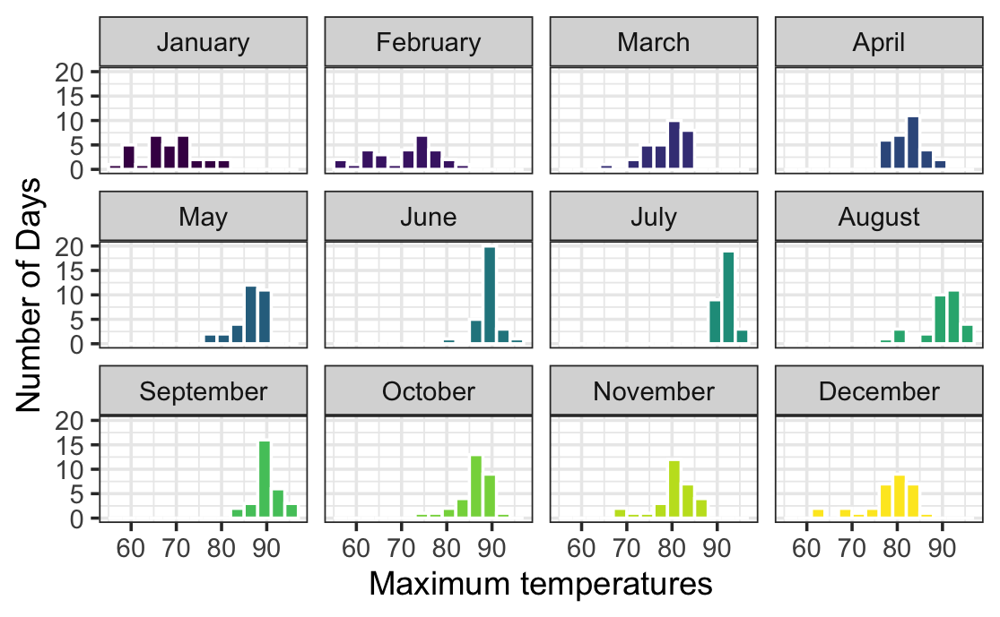
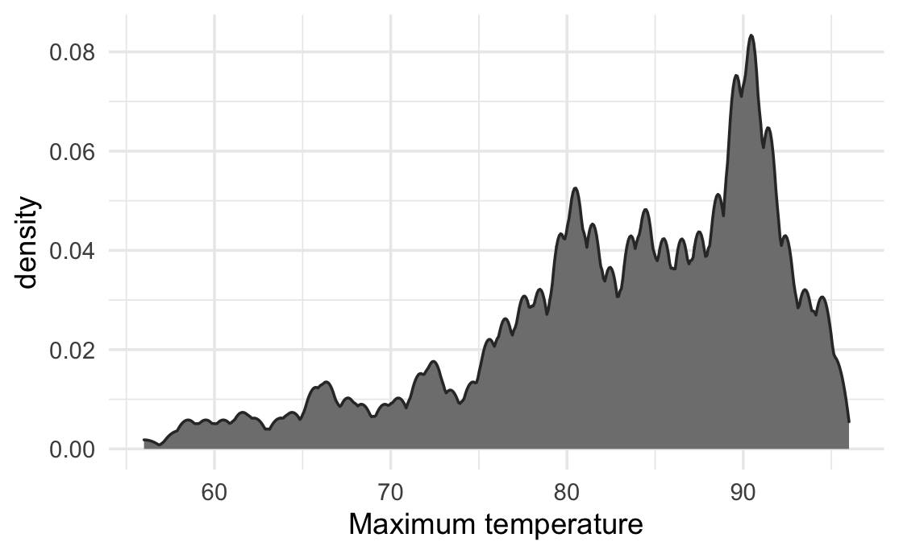
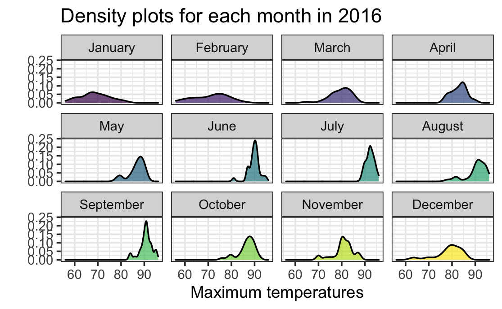
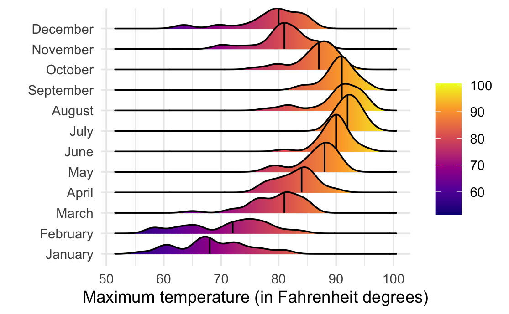
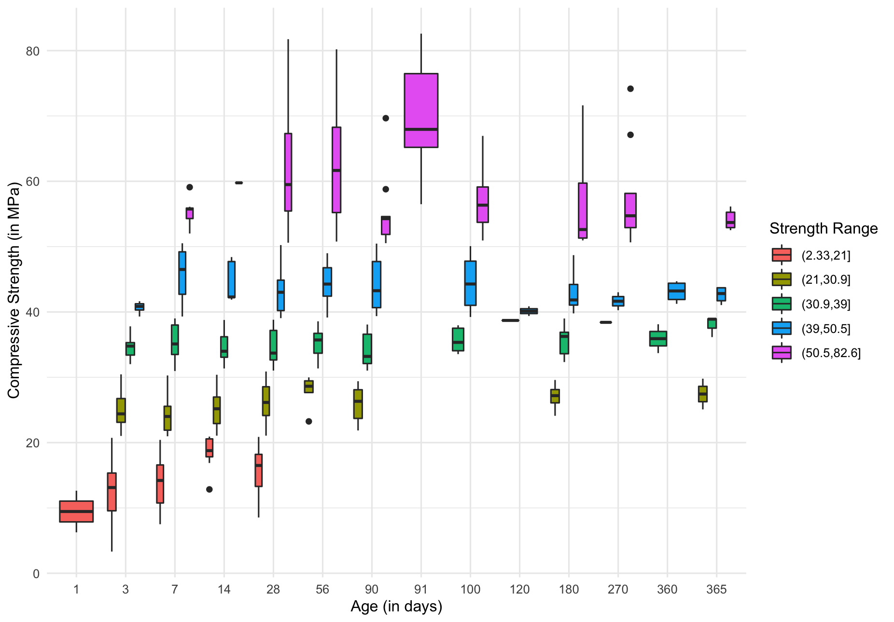
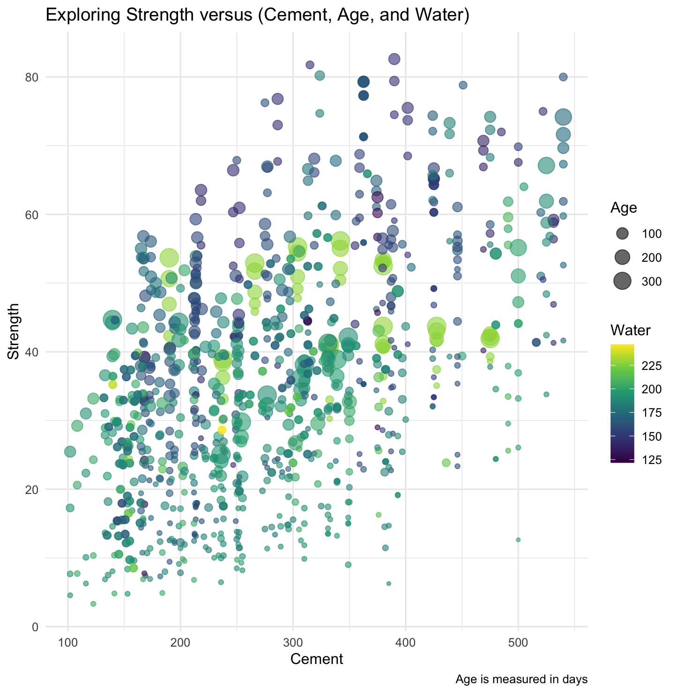

# Data Visualization Project 3

In this exercise you will explore methods to create different types of data visualizations (such as plotting text data, or exploring the distributions of continuous variables).

## PART 1: Density Plots

Using the dataset obtained from FSU's [Florida Climate Center](https://climatecenter.fsu.edu/climate-data-access-tools/downloadable-data), for a station at Tampa International Airport (TPA) for 2022, attempt to recreate the charts shown below which were generated using data from 2016. You can read the 2022 dataset using the code below:

```{r, message=FALSE, warning=FALSE}
library(tidyverse)
library(lubridate)
library(ggridges)
library(plotly)
```

```{r, message=FALSE, warning=FALSE}
weather_tpa <- read_csv("../data/tpa_weather_2022.csv")
sample_n(weather_tpa, 4)
```

```{r, message=FALSE, warning=FALSE}
tpa_clean <- weather_tpa %>% 
  filter(max_temp != -99.9, min_temp != -99.9, precipitation != -99.99) %>% 
  unite("doy", year, month, day, sep = "-") %>% 
  mutate(doy = ymd(doy), 
         max_temp = as.double(max_temp),
         min_temp = as.double(min_temp), 
         precipitation = as.double(precipitation),
         month_name = month(doy, label = TRUE, abbr = FALSE))
```

Using the 2022 data: 

(a) Create a plot like the one below:

```{r, echo = FALSE, out.width="80%", fig.align='left'}

```

```{r, message=FALSE, warning=FALSE, fig.alt="Faceted histogram showing maximum monthly temperatures (°F) for 2022. Summer months show a tight distribution clustered around the mid 90s, while winter months show a much wider variation from the low 40s to the mid 80s."}
ggplot(tpa_clean, aes(x = max_temp)) +
  geom_histogram(binwidth = 3, color = "white", aes(fill = month_name)) +
  facet_wrap(~month_name) +
  labs(title = "Faceted Histogram of Maximum Monthly Temperatures (2022)", 
       x = "Maximum Temperature (°F)", 
       y = "Number of Days") +
  theme(plot.title = element_text(hjust = 0.5), 
        plot.background = element_rect(fill = "white"),
        panel.background = element_rect(fill = "white"), 
        panel.grid.major = element_line(color = "lightgray", size = 0.7), 
        panel.grid.minor = element_line(color = "lightgray", size = 0.3), 
        panel.border = element_rect(color = "black", fill = NA),
        strip.background = element_rect(fill = "lightgray", color = "black"), 
        legend.position = "none")
```

>*This faceted histogram displays the maximum monthly temperatures (°F) experienced throughout 2022 as well as the number of days each temperature was reached. The winter months of December, January, and February display a broader range of temperatures ranging from the yearly lows of the mid 40s to the mid 80s. Conversely, the summer months of June, July, and August, unlike the winter months, exhibit a much tighter range of temperatures and also feature yearly temperature highs in the mid to high 90s.*

(b) Create a plot like the one below:

```{r, echo = FALSE, out.width="80%", fig.align='left'}

```

```{r, message=FALSE, warning=FALSE, fig.alt="An aggregate density plot of maximum temperatures (°F) in Tampa for 2022. Though the range of temperatures experienced throughout the year is rather broad with the low being around the mid 40s and the high being around the high 90s, during the majority of the year, the temperatures in Tampa range from the low 80s to the mid 90s."}
ggplot(tpa_clean, aes(x = max_temp)) +
  geom_density(bw = 0.5, fill = "gray50", size = 0.7, kernel = "gaussian") +
  labs(title = "Density Plot of Maximum Temperatures", 
       x = "Maximum Temperature (°F)", 
       y = "Density", 
       fill = "Month") +
  theme(plot.title = element_text(hjust = 0.5), 
        panel.background = element_rect(fill = "white"), 
        panel.grid.major = element_line(color = "lightgray", size = 0.7), 
        panel.grid.minor = element_line(color = "lightgray", size = 0.3),
        axis.title.y = element_text(vjust = 3))
```

>*This aggregate density plot showcases Tampa's maximum temperature (°F) profile across the entirety of 2022. Though the range of temperatures experienced throughout the year is rather broad with the low being around the mid 40s and the high being around the high 90s, it can be clearly seen that the majority of the data lies on the right side of the figure. This would indicate that during most of the year, the temperatures in Tampa range from the low 80s to the mid 90s.*

(c) Create a plot like the one below:

```{r, echo = FALSE, out.width="80%", fig.align='left'}

```

```{r, message=FALSE, warning=FALSE, fig.alt="Faceted density curves of maximum monthly temperatures (°F). It shows wide, flat curves indicating high temperature variability in winter, and tall, narrow spikes indicating hot weather in July and August."}
ggplot(tpa_clean, aes(x = max_temp)) +
  geom_density(alpha = 0.7, size = 1, aes(fill = month_name)) +
  facet_wrap(~ month_name) +
  labs(title = "Faceted Density Plot of Maximum Monthly Temperatures", 
       x = "Maximum Temperature (°F)", 
       y = "Density") + 
  theme(plot.title = element_text(hjust = 0.5), 
        plot.background = element_rect(fill = "white"),
        panel.background = element_rect(fill = "white"), 
        panel.grid.major = element_line(color = "lightgray", size = 0.7), 
        panel.grid.minor = element_line(color = "lightgray", size = 0.3), 
        panel.border = element_rect(color = "black", fill = NA),
        strip.background = element_rect(fill = "lightgray", color = "black"),
        axis.title.y = element_blank(),
        legend.position = "none")
```

>*In this faceted density plot, a clear contrast between monthly temperature (°F) volatility can be seen. In the summer months of July and August, tall and narrow density curves can be seen which indicates low temperature variance. However, for the winter months of December, January, and February, wider and flatter curves can be seen showcasing the day-to-day temperature variability that is seen during the cooler months.*

(d) Generate a plot like the chart below:

```{r, echo = FALSE, out.width="80%", fig.align='left'}
 
```

```{r, message=FALSE, warning=FALSE, fig.alt="A ridgeline plot organizing maximum temperatures (°F) chronologically by month. The ridges physically shift to the right and transition from deep blue to bright yellow as the temperatures increase into the summer months. They then begin to move back left as temperatures begin to decrease towards the end of fall and into winter."}
ggplot(tpa_clean, aes(x = max_temp, y = month_name, fill = stat(x))) +
  geom_density_ridges_gradient(quantile_lines = TRUE, quantiles = 2, alpha = 0.7) +
  scale_fill_viridis_c(option = "plasma", breaks = c(40, 60, 80, 100),
                       labels = c("40", "60", "80", "100")) +
  guides(fill = guide_colorbar(
    barwidth = unit(0.8, "cm"),
    barheight = unit(3.5, "cm"))) + 
  labs(title = "Ridgeline Plot of Maximum Temperatures by Month", 
       x = "Maximum Temperature (°F)",
       fill = NULL) +
  theme(plot.title = element_text(hjust = 0.5), 
        panel.background = element_rect(fill = "white"), 
        panel.grid.major = element_line(color = "lightgray", size = 0.7), 
        panel.grid.minor = element_line(color = "lightgray", size = 0.3), 
        axis.title.x = element_text(size = 12),
        axis.title.y = element_blank(),
        axis.text = element_text(size = 10))
```

>*The above ridgeline plot displays the chronological view of the shifting temperatures (°F) throughout 2022 in Tampa, Florida. In the winter months of January and February, the ridges begin to shift to the right as temperatures increase into the summer months where the ridges peak at their highest temperature values. Then, shortly after the summer season has ended, the ridges start to broaden and move to the left as cooler temperatures become present towards the end of fall months in October and November, then reaching its left most position during the winter month of December, concluding the year.*

(e) Create a plot of your choice that uses the attribute for precipitation _(values of -99.9 for temperature or -99.99 for precipitation represent missing data)_.

```{r, message=FALSE, warning=FALSE, fig.alt="An interactive time-series line plot tracking daily precipitation in Tampa. It features a prominent rainfall spike during indicating that the rainy season takes place during the summer months as well as the beginning of the fall season. This is supported by a dark blue smoothing line, which also emphasizes the summer rainy season."}
plot <- ggplot(tpa_clean, aes(x = doy, y = precipitation)) +
  geom_line(color = "blue", alpha = 0.6) +
  geom_smooth(color = "darkblue", method = "loess", name = "Trend") +
  labs(title = "Daily Precipitation Trends in Tampa From January 1 2022 to January 1 2023",
       y = "Precipitation (inches)") +
  theme(plot.background = element_rect(fill = "white"),
        panel.background = element_rect(fill = "white"), 
        panel.grid.major = element_line(color = "lightgray"), 
        panel.grid.minor = element_line(color = "lightgray"), 
        axis.title.y = element_text(vjust = 3),
        axis.title.x = element_blank())

interactive_plot <- ggplotly(plot, tooltip = c("x", "y"))
interactive_plot$x$data[[2]]$hoverinfo <- "none"
interactive_plot$x$data[[3]]$hoverinfo <- "none"

interactive_plot <- interactive_plot %>%
  layout(
    xaxis = list(
      rangeslider = list(type = "date"), 
      rangeselector = list(buttons = list(
        list(count = 1, label = "1m", step = "month", stepmode = "backward"), 
        list(count = 3, label = "3m", step = "month", stepmode = "backward"), 
        list(step = "all", label = "All")))))

interactive_plot
```

>*This figure displays the volatile trends of rainfall in Tampa, Florida over the course of 2022. It can be seen that the rainy season takes place during the summer and fall months, peaking around late July both in intensity and volume. This trend is also reflected in the dark blue LOESS smoothing trend line which displays that rainfall increased from the spring months into the summer and fall months, then decreases again into the winter months. This plot is interactive. By clicking and dragging the cursor on the plot, a specific range of data can be viewed in more detail. Double-clicking on the plot will return to normal viewing when zoomed in.*

**Interactive vs. Static Visualizations:** A static version of this chart suffers heavily from visual crowding due to the nature of this highly erratic precipitation data, making individual dates difficult to isolate and view. However, when incorporating interactivity into this chart, it solves this by letting the reader hover over any single peak to extract precise local values and exact dates instantly. Furthermore, the inclusion of a range slider allows any user to dynamically isolate specific stormy weeks or dry spells, providing more accessibility for inspection of the data that a static data visualization simple could not.

## Bad Chart Redesign: Monthly Temperature Distributions

### Original Version (Before Redesign)

```{r, message=FALSE, warning=FALSE, fig.alt="An aggregate density plot overlaying twelve distinct monthly temperature (°F) curves on a single set of axes. Due to severe overlapping, the individual curves, especially for the summer months, blend into somewhat unreadable spikes, completely obscuring the unique shape and range of each month's distribution."}
ggplot(tpa_clean, aes(x = max_temp, fill = month_name)) +
  geom_density(alpha = 0.3) +
  labs(title = "Maximum Temperatures by Month", 
       x = "Maximum Temperature (°F)", 
       y = "Density") +
  theme(plot.title = element_text(hjust = 0.5), 
        panel.background = element_rect(fill = "white"), 
        panel.grid.major = element_line(color = "lightgray", size = 0.7), 
        panel.grid.minor = element_line(color = "lightgray", size = 0.3),
        legend.title = element_blank())
```

**Discussion:** This overlapping density plot attempts to compare the maximum temperature (°F) profiles of all twelve months simultaneously on a single axis. While intended to provide a direct comparison, it is visually cluttered and the density shapes blend into one another masking the data. This makes it impossible to isolate individual trends or accurately trace where one month ends and another begins, especially in the summer months.

### Improved Version (After Redesign)

```{r, message=FALSE, warning=FALSE, fig.width=6, fig.height=7, fig.alt="A horizontal hybrid visualization displaying monthly maximum temperature (°F) distributions for 2022. Twelve sequentially stacked violin plots illustrate the density curves for each month horizontally, while nested white boxplots mark the median and IQR. The layout captures wide, flat winter distributions transitioning into tight, high-temperature summer distributions near the mid 90s."}
violin_boxplot <- ggplot(tpa_clean, aes(x = max_temp, y = month_name, fill = month_name)) +
  geom_violin(alpha = 0.5, color = "black", scale = "width") +
  geom_boxplot(width = 0.15, fill = "white", color = "black", outlier.shape = NA, alpha = 0.8) +
  scale_fill_viridis_d(option = "viridis") +
  labs(title = "Monthly Maximum Temperature Distributions (2022)",
       x = "Maximum Temperature (°F)",
       y = "Month") +
 theme(plot.title = element_text(hjust = 0.5, size = 14), 
       panel.background = element_rect(fill = "white"), 
       panel.grid.major = element_line(color = "lightgray", size = 0.7), 
       panel.grid.minor = element_line(color = "lightgray", size = 0.3), 
       axis.title.x = element_text(size = 12),
       axis.text = element_text(size = 10),
       axis.title.y = element_blank(),
       legend.position = "none")

violin_boxplot

ggsave(filename = "../figures/tpa_monthly_violin_boxplot.png", 
       plot = violin_boxplot, 
       width = 6, 
       height = 7, 
       dpi = 300)
```

**Discussion:** This horizontal hybrid violin-boxplot resolves the data occlusion of the overlapping plot by separating all twelve months sequentially along the vertical axis. The horizontal layout provides a clean progression that allows for immediate tracking of the changing temperatures throughout 2022. The violin geometries successfully preserve the unique density distributions of each month, revealing volatile, wide temperature spans in the winter months of January and February, shifting toward narrow distributions centered around the mid 90s during the peak summer months of July and August. Additionally, the nested boxplots cleanly show the median and quartile values for each month without leading to visual clutter.

## PART 2 

> **You can choose to work on either Option (A) or Option (B)**. Remove from this template the option you decided not to work on.

### Option (B): Data on Concrete Strength 

Concrete is the most important material in **civil engineering**. The concrete compressive strength is a highly nonlinear function of _age_ and _ingredients_. The dataset used here is from the [UCI Machine Learning Repository](https://archive.ics.uci.edu/ml/index.php), and it contains 1030 observations with 9 different attributes 9 (8 quantitative input variables, and 1 quantitative output variable). A data dictionary is included below: 

Variable                      |    Notes                
------------------------------|-------------------------------------------
Cement                        | kg in a $m^3$ mixture             
Blast Furnace Slag            | kg in a $m^3$ mixture  
Fly Ash                       | kg in a $m^3$ mixture             
Water                         | kg in a $m^3$ mixture              
Superplasticizer              | kg in a $m^3$ mixture
Coarse Aggregate              | kg in a $m^3$ mixture
Fine Aggregate                | kg in a $m^3$ mixture      
Age                           | in days                                             
Concrete compressive strength | MPa, megapascals

Below we read the `.csv` file using `readr::read_csv()` (the `readr` package is part of the `tidyverse`)

```{r}
concrete <- read_csv("../data/concrete.csv", col_types = cols())
```

Let us create a new attribute for visualization purposes, `strength_range`: 

```{r}
new_concrete <- concrete %>%
  mutate(strength_range = cut(Concrete_compressive_strength, 
                              breaks = quantile(Concrete_compressive_strength, 
                                                probs = seq(0, 1, 0.2))))
```

1. Explore the distribution of 2 of the continuous variables available in the dataset. Do ranges make sense? Comment on your findings.

```{r, message=FALSE, warning=FALSE, fig.alt="A histogram showing the distribution of cement content across the concrete samples. The values range from roughly 100 kg/m³ to over 500 kg/m³, with a heavy concentration of data points falling below 400 kg/m³, representing ordinary and standard concrete categories and grades."}
ggplot(new_concrete, aes(x = Cement)) +
  geom_histogram(binwidth = 30, fill = "darkgrey", color = "white", alpha = 0.8) +
  labs(title = "Distribution of Cement Content",
       x = "Cement (kg in a m³ mixture)",
       y = "Count") +
  theme(plot.title = element_text(hjust = 0.5),
        panel.background = element_rect(fill = "white"), 
        panel.grid.major = element_line(color = "lightgray"), 
        panel.grid.minor = element_line(color = "lightgray"))
```

**Cement Content Ranges & Distribution:** The cement content shown in the above histogram ranges roughly from a little less than $100 \text{ kg/m}^3$ to over $500 \text{ kg/m}^3$, and after some [research](https://pennarrmc.com/grades-of-concrete/), this range does of values does indeed make sense. Concrete mixtures depending on the grade, were found to range roughly from $170 \text{ kg/m}^3$ on the lower end up to $510 \text{ kg/m}^3$on the high end. Now, there are three main categories of concrete mixtures which exist, those being *ordinary concrete*, *standard concrete*, and *high-strength concrete*. Each of these three main categories has different grades which fall into their respective categories depending on their mechanical properties. *Ordinary concrete* and *standard concrete* are the most common and they tend to see mixtures with cement content under $400 \text{ kg/m}^3$, whereas *high-strength concrete* is less common and typically sees mixtures with cement content over $400 \text{ kg/m}^3$. When taking this into account, the range of values found above does make complete sense as most of the data points are found to be under $400 \text{ kg/m}^3$ falling into the categories of either *ordinary concrete* or *standard concrete* which are more commonly used, while less data points are over $400 \text{ kg/m}^3$ and fall into the category of *high-strength concrete* which is less commonly utilized.

```{r, message=FALSE, warning=FALSE, fig.alt="A histogram displaying the distribution of water content in the concrete mixtures. The distribution spans from approximately 120 kg/m³ to 250 kg/m³, with the vast majority of the samples clustering tightly between 160 kg/m³ and 200 kg/m³."}
ggplot(new_concrete, aes(x = Water)) +
  geom_histogram(binwidth = 10, fill = "lightblue", color = "white", alpha = 0.8) +
  labs(title = "Distribution of Water Content",
       x = "Water (kg in a m³ mixture)",
       y = "Count") +
  theme(plot.title = element_text(hjust = 0.5),
        panel.background = element_rect(fill = "white"), 
        panel.grid.major = element_line(color = "lightgray"), 
        panel.grid.minor = element_line(color = "lightgray"))
```

**Water Content Ranges & Distribution:** The water content shown in this histogram ranges from approximately $120 \text{ kg/m}^3$ to nearly $250 \text{ kg/m}^3$. This range is realistic as the typical water to cement ratio typically lies between [0.3 to 0.8](https://concretecountertopinstitute.com/free-training/the-importance-of-water-cement-ratio-in-concrete-countertop-mix-design/). Now, having a higher water to cement ratio will lead to a weaker and more brittle concrete mixture, while having a lower water to cement ratio will lead to a stronger mixture, with a ratio of 0.6 - 0.7 being the average. When taking into account that the majority of data points for cement fell between $160 \text{ kg/m}^3$ and $400 \text{ kg/m}^3$, the respective range for water should fall between $115 \text{ kg/m}^3$ and $240 \text{ kg/m}^3$. This is almost what the data exactly reflects, therefore, verifying that the range is indeed realistic.

2. Use a _temporal_ indicator such as the one available in the variable `Age` (measured in days). Generate a plot similar to the one shown below. Comment on your results.

```{r, echo = FALSE, out.width="80%", fig.align='center'}

```

```{r, message=FALSE, warning=FALSE, fig.alt="Side-by-side boxplots mapping concrete compressive strength across discrete age milestones, colored by strength range quantiles. The visualization shows an trending upward shift in strength over time, the complete disappearance of the lowest strength category after 28 days, and a peak concentration of high-strength concrete around 91 days of aging."}
ggplot(new_concrete, aes(x = as.factor(Age), y = Concrete_compressive_strength, fill = strength_range)) +
  geom_boxplot(outlier.size = 1) +
  scale_fill_viridis_d(option = "viridis") +
  labs(x = "Age (in days)",
       y = "Compressive Strength (in MPa)",
       fill = "Strength Range") +
  theme(panel.background = element_rect(fill = "white"),
        panel.grid.major = element_line(color = "lightgray", size = 0.3),
        panel.grid.minor = element_line(color = "lightgray", size = 0.1),
        legend.position = "right")
```

**Discussion:** This boxplot data visualization showcases `Concrete_compressive_strength` across various `age` milestones while being segmented by the calculated `strength_range` quantiles. Early on, a trend showing an increase in the compressive strength can be seen as the strength range transitions from just including the (dark purple, 2.33 – 21 MPa) range to include the (dark blue, 21 – 30.9 MPa) range, then the (teal, 30.9 – 39 MPa) range, etc. as the aging process goes on. However, at 28 days, this trend seems to end alongside the presence of the lowest strength range (dark purple, 2.33 – 21 MPa) which completely disappears as the aging process continues. As for the highest peak compressive strengths, they are heavily concentrated around the 91-day mark. Though, once past 90 days, primarily from 180 to 365 days, the distribution stabilizes, and fewer high-strength outliers are observed.

3. Create a scatterplot similar to the one shown below. Pay special attention to which variables are being mapped to specific aesthetics of the plot. Comment on your results. 

```{r, echo = FALSE, out.width="80%", fig.align='center'}

```

```{r, message=FALSE, warning=FALSE, fig.width=6, fig.height=7, fig.alt="A comprehensive scatterplot exploring concrete compressive strength against cement content on the axes, with water content mapped to a viridis color scale and age mapped to point size. It highlights that the highest compressive strengths are achieved by mixtures that have higher cement volumes and lower water content while having been aged for longer."}
ggplot(concrete, aes(x = Cement, y = Concrete_compressive_strength, color = Water, size = Age)) +
  geom_point(alpha = 0.6) +
  scale_color_viridis_c(option = "viridis") +
  scale_size_continuous(breaks = c(100, 200, 300)) +
  labs(title = "Exploring Strength versus (Cement, Age, and Water)",
       x = "Cement (kg in a m³ mixture)",
       y = "Compressive Strength (in MPa)",
       color = "Water",
       size = "Age",
       caption = "Age is measured in days") +
  theme(plot.title = element_text(size = 14), 
        plot.caption = element_text(hjust = 1, size = 10),
        panel.background = element_rect(fill = "white"),
        panel.grid.major = element_line(color = "lightgray", size = 0.3),
        panel.grid.minor = element_line(color = "lightgray", size = 0.1),
        axis.title = element_text(size = 12),
        legend.position = "right")
```

**Discussion:** This scatterplot visualizes the multi-variable relationship influencing the compressive strength of concrete. A notable positive correlation between `Cement` content and `Compressive Strength` can be seen as when the cement content increases from $100 \text{ kg/m}^3$ to over $500 \text{ kg/m}^3$, the baseline strength floor noticeably rises. Another positive correlation can be seen between `Age` and `Compressive Strength` as the highest strength values are overwhelmingly populated by points that are approaching or exceeding 100 days in age. On the other hand, the opposite type of correlation is seen between `Water` and `Compressive Strength` with the strength of the concrete mixture increasing with less water content ($125 \text{ kg/m}^3$ to $175 \text{ kg/m}^3$). Conversely, the bright yellow-green clusters (`Water` content > $200 \text{ kg/m}^3$) are heavily concentrated at lower strength. This shows that in order to optimize the compressive strength of concrete, one must maximize cement volume, minimize water volume, and allow over 90 - 100 days of aging to take place.
