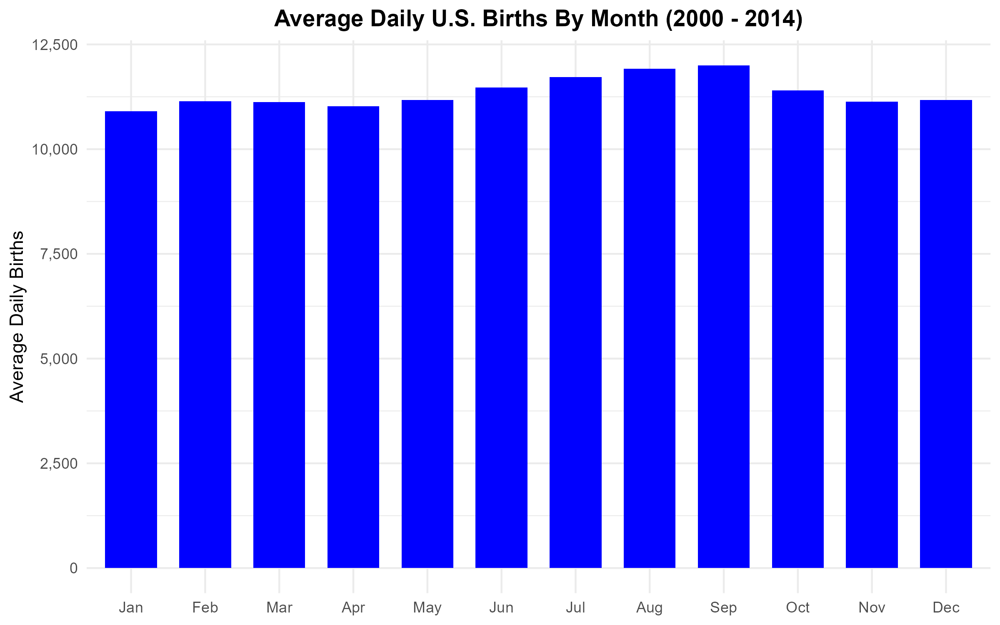
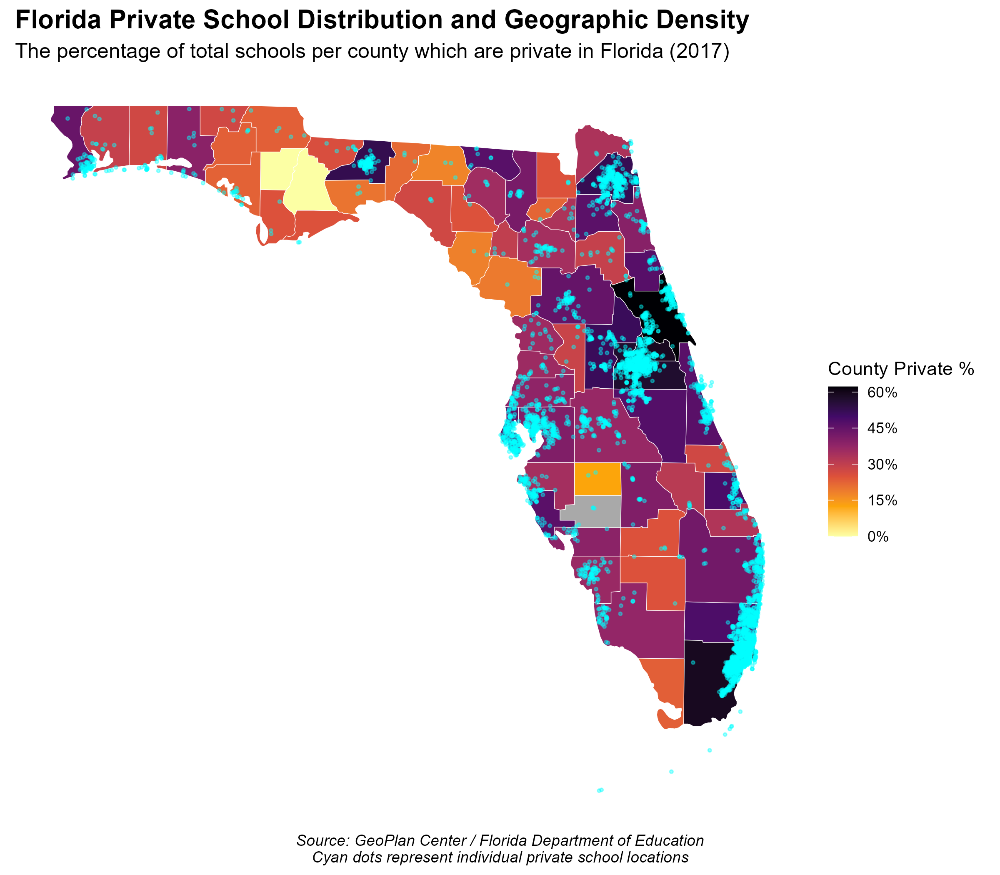
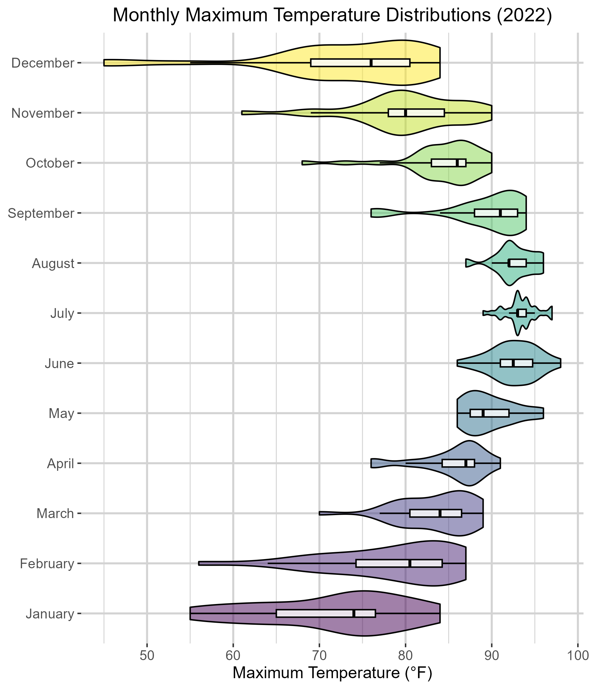

# Data Visualization and Reproducible Research

> Justin Kohler 

The following is a sample of products created during the _"Data Visualization and Reproducible Research"_ course.

## Project 01

In the `Project 1/` folder you can find a thorough report which analyzes historical birth patterns across the United States
from 2000 to 2014 using the `tidyverse` suite amongst other libraries. This project was motivated by demographic concerns
regarding declining birth rates falling below the replacement rate. This project applies core data visualization principles
including reducing chart junk, deploying color strategically, and integrating the Gestalt principles of proximity and
continuity to uncover how factors like economic conditions, seasonal cycles, and standard hospital deliveries operations
influence national birth distributions. A central focus of this project was executing a "Bad Chart Redesign" to resolve
calendar day bias; rather than distorting seasonal trends through raw monthly aggregates that artificially penalize shorter
months like February, the data was mutated into a true normalized average daily birth rate to ensure an accurate seasonal
evaluation. The resulting visualization suite reveals that national birth rates are highly sensitive to macroeconomic
conditions, rising during early-2000s stability to peak at over 4.3 million in 2007 before entering a sharp decline 
immediately following the onset of the 2008 Great Recession. Furthermore, the analysis exposes a resilient seasonal 
baseline peaking in August and September alongside a stark administrative discrepancy where average daily births remain 
elevated above 13,000 on standard workdays but plunge to roughly 7,500 on weekends due to hospital labor scheduling for 
medically assisted delivery procedures.

**Sample data visualization:** This visualization highlights the "Bad Chart Redesign" workflow executed to eliminate
systemic calendar day bias from seasonal trend analysis. While traditional visualizations plot raw monthly 
aggregates—falsely penalizing shorter months like February and artificially inflating 31-day months—this 
redesigned line chart plots a true normalized average daily birth rate across a fifteen-year horizon. 
By utilizing a highly intentional, accessible color palette paired with deliberate structural line 
hierarchies, the visualization isolates true seasonal micro-trends, demonstrating a resilient national
peak in August and September followed by a consistent decline through the winter months.

## Project 02

In this project, I explored advanced technical suite that applies data visualization frameworks across three independent, 
unique datasets to evaluate athletic performance volatility, spatial data density, and demographic model significance.
Using RStudio alongside a production stack of packages including `tidyverse`, `plotly`, `sf`, `maps`, and `broom`, this
project shifts from raw statistical aggregation into clean, context-driven storytelling workflows. The technical pipeline
explicitly addresses data engineering hurdles, drop-handling point geometries to compute clean spatial county joins, 
cleaning localized whitespaces, and transforming binary indicators into factorized reference baselines to isolate 
structural coefficient standard errors. The completed project yields critical real-world insights, proving via linear
regression with 95% confidence that education and age act as the primary, highly significant drivers of personal 
income—with education yielding twice the impact of age—while successfully demonstrating high game-to-game volatility 
across tracked metrics in professional basketball championship finals series. Find the code and report in the 
`Project 2/` folder.

**Sample data visualization:** This spatial visualization highlights a "Bad Chart Redesign" workflow executed to resolve
critical geographic precision flaws found in standard regional maps. While a traditional baseline choropleth uniformly 
shades entire county polygons—falsely implying that schools are evenly spread across unpopulated wetlands and 
agricultural zones—this redesigned map overlays the precise latitudinal and longitudinal coordinate positions 
of every private institution as distinct cyan marker points. Shaded using a continuous, accessible *inferno*
color palette to display county-wide private school percentages, this dual-layer map reveals a profound 
structural truth: private schools are intensely clustered within high-density urban municipal centers and
coastal developments, leaving the rural interior regions of those exact same counties entirely empty.

## Project 03

In this project, I explored an expansive exploratory data analysis suite evaluating environmental climate distributions
and industrial material engineering properties using advanced continuous variable visualization techniques. Working 
with the RStudio environment and utilizing a robust toolkit including `tidyverse`, `lubridate`, `ggridges`, and `plotly`,
this project processes weather observation streams from the Tampa International Airport alongside a non-linear concrete
compressive strength engineering dataset. The climate pipeline details daily temperature profile variations using faceted
histograms, aggregate curves, and multi-layered chronological ridgeline plots, alongside a volatile daily precipitation
time-series plot fitted with a dynamic LOESS smoothing trend line. Concurrently, the material engineering pipeline 
analyzes independent cement and water volume counts, evaluates material strength changes over distinct curing milestones
via quantile-colored boxplots, and maps multi-variable physical thresholds using an enhanced four-dimensional scatterplot. 
The completed report uncovers critical structural insights, such as the complete disappearance of low-strength concrete 
configurations past 28 days of aging and a severe administrative dependency on high summer rainfall cycles in regional 
weather observations.

**Sample data visualization:** This horizontal hybrid violin-boxplot represents a "Bad Chart Redesign" workflow executed
to solve data occlusion and severe visual clutter in multi-group distribution comparisons. Instead of overlapping twelve
distinct monthly temperature density curves on a single set of axes—which blend into unreadable spikes and completely 
mask individual data shapes—this improved visualization isolates each month sequentially along the vertical axis using
a continuous *viridis* color palette. The horizontal violin geometries successfully preserve and contrast unique seasonal
distributions, cleanly revealing wide, highly volatile winter temperature fluctuations against tightly compressed, 
high-temperature spikes centered around the mid-90s in July and August. Concurrently, nested white boxplots mark exact
median and interquartile ranges, adding secondary statistical parameters without contributing to visual chart junk.

### Moving Forward

_Please add here a short reflection on what you learned and what you plan to continue exploring in terms of data visualization, data storytelling, reproducible research, and/or related topics._
